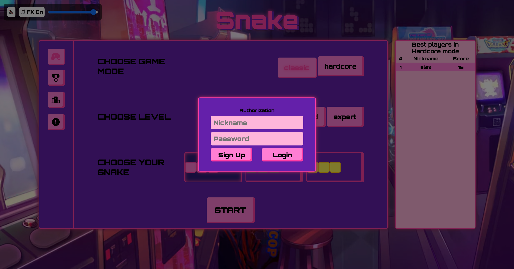
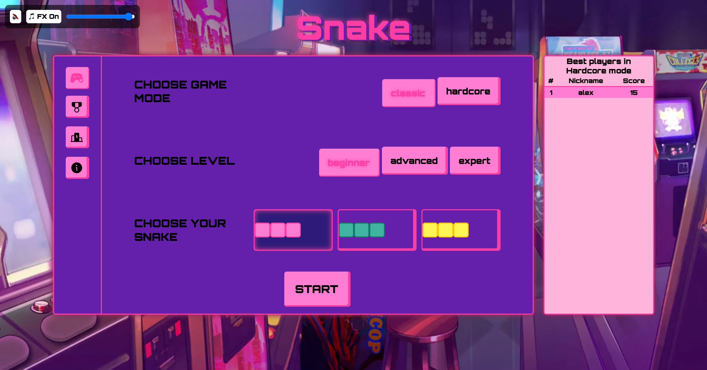
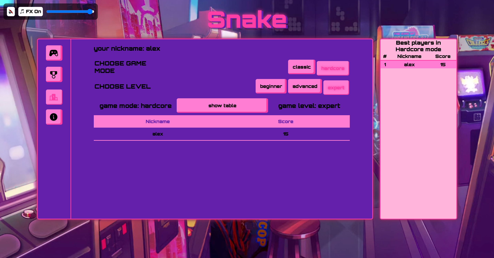
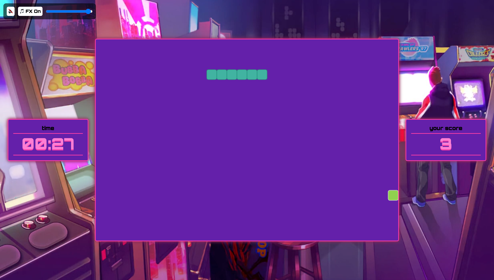
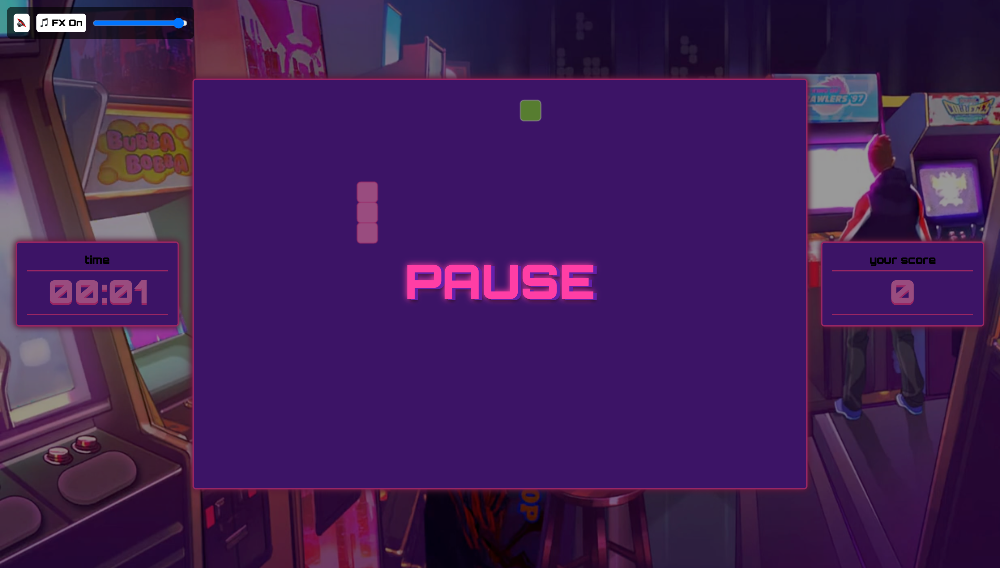
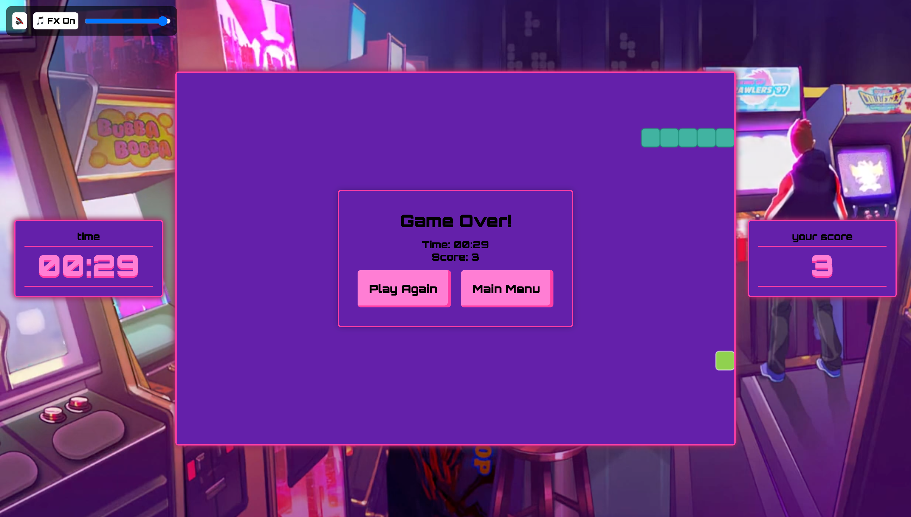

# 🐍 RETRO NEON ARCADE SUPER COOL SNAKE GAME

**Sorry, but Live Demo no working yet**
https://..............

**GitHub Repository:**
https://github.com/Alexey-Zanevsky/snakeGame/tree/my-version

A modern interpretation of the classic "Snake" game with neon design, multiple game modes, and a ranking system.

# Screenshots
## Authorization



## Menu



## Rating



## Game


## Pause


## GameOver


## 📋 Requirements

Before you start, make sure you have installed:
- **Node.js** (version 14 or higher) - [download](https://nodejs.org/)
- **npm** (comes with Node.js)
- **MongoDB Atlas** account (or local MongoDB)
- Modern web browser (Chrome, Firefox, Safari, Edge)

## 🚀 Quick Start

### 1. Clone the Repository

```bash
git clone <repository-link>
cd snakeGame
```

### 2. Install Dependencies

```bash
npm install
```

### 3. Environment Variables Setup

Create a `.env` file in the project root (`/snakeGame/.env`):

```env
PORT=3001
JWT_SECRET=your_super_secret_key_change_this
DB_PASSWORD=your_mongodb_password
```

**Getting MongoDB Credentials:**
1. Register on [MongoDB Atlas](https://www.mongodb.com/cloud/atlas)
2. Create a cluster and database
3. Get the connection string with password
4. Insert the password in `DB_PASSWORD`

### 4. Run the Server (Backend)

Open the first terminal and run:

```bash
npm start
```

You should see:
```
SERVER IS RUNNING ON 3001
```

### 5. Run the Client (Frontend)

Open a second terminal and launch Live Server:

```bash
# Option 1: If Live Server is installed (VS Code extension)
# Right-click on index.html → Open with Live Server
# OR press Alt+L, Alt+O

# Option 2: Using npx
npx live-server --port=5500
```

### 6. Open the Game

Open your browser and navigate to:
```
http://localhost:5500
```

## 🎮 How to Play

1. **Sign Up/Login** - Create an account or login
2. **Choose Game Mode**:
   - **Classic** - Classic mode with difficulty levels (Beginner, Advanced, Expert)
   - **Hardcore** - Extreme mode with one difficulty level
3. **Select Snake Skin** - Choose the color or design of your snake
4. **Controls**:
   - **Arrow Keys** or **WASD** - move the snake
5. **Rankings** - View top players in each game mode

## 📁 Project Structure

```
snakeGame/
├── index.html                 # Main page
├── style.css                  # Main styles
├── menu__styles.css           # Menu styles
├── package.json               # Node.js dependencies
├── .env                       # Environment variables (create this)
├── jscode/
│   ├── server.js              # Main Express server
│   ├── script.js              # Main client JavaScript
│   ├── config.js              # Configuration
│   ├── authRouter.js          # Authentication routes
│   ├── authController.js      # Authentication logic
│   ├── classic__game.js       # Classic mode logic
│   ├── hardcore__game.js      # Hardcore mode logic
│   ├── base__game.js          # Base game class
│   ├── models/
│   │   ├── user.js            # User model
│   │   └── role.js            # Role model
│   └── middleware/
│       └── authMiddleware.js  # Token verification
├── sounds/                    # Music and sound effects
├── imgs/                      # Images
└── api/
    └── index.js               # API for Vercel
```

## 📊 API Endpoints

### Authentication
- `POST /auth/registration` - User registration
- `POST /auth/login` - User login

### Game Data
- `POST /auth/score` - Update high score (requires token)
- `GET /auth/ranking/:mode/:difficulty` - Get ranking
- `GET /auth/ranking/hardcore` - Get hardcore ranking

## 🎨 Technologies

- **Frontend**: Vanilla JavaScript (ES6 modules), HTML5, CSS3
- **Backend**: Node.js, Express.js
- **Database**: MongoDB Atlas
- **Authentication**: JWT (JSON Web Tokens)
- **Animations**: GSAP
- **Deployment**: Vercel


